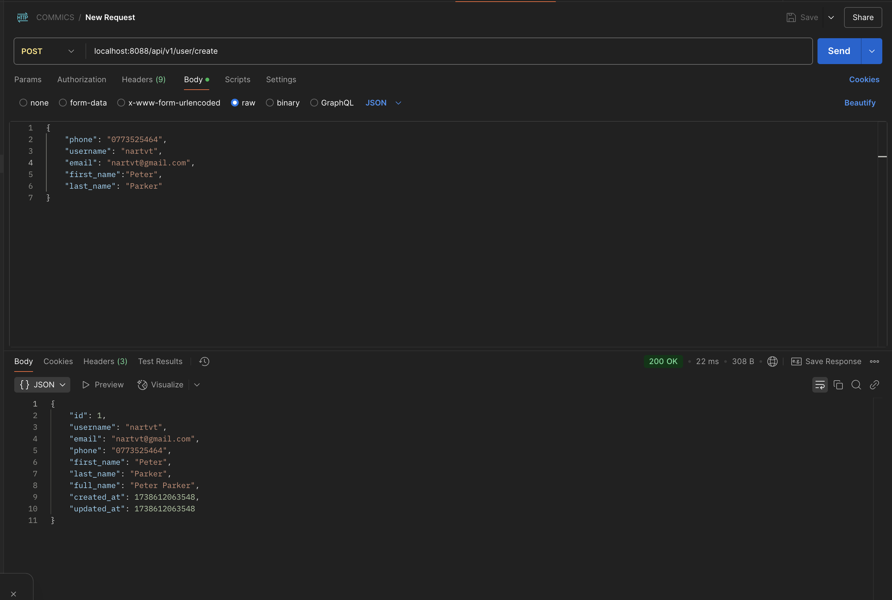

1. Copy env.example to .env

in application-\*.yaml , upper case with prefix APP\_

example:

```
server:
  port: 8080
```

in .env file

```
APP_SERVER_PORT=8088

```

same with another attribute in application-\*.yaml

#### prepare database

go to docker: `cd docker folder`

run: `sh run.sh up`

### migration format

V1\_\_name of migration.sql

### generate swaggger

make docs

### Run service

make run

### run service

in back-end.sh change environment to env need

at: `./back-end-client -config ./config/application.yaml -env <environment>`

example change to dev environment: dev

=> `./back-end-client -config ./config/application.yaml -env dev`

sh back-end.sh start




## APIS

## Genres Page

GetAllGenres

https://www.mh5.xyz/index.php/category/

GetPopularComicsByClassification
(Genres,progress(comics table), audience(comics table), language(comics table). ASC of update time )

https://www.mh5.xyz/index.php/category/

GetLatestUpdateComicsByGenres(same above but with DESC update time)
https://www.mh5.xyz/index.php/category/

## Home Page

https://www.mh5.xyz/
GetAdsComics, 5 for carousel

GetGenresHomePage (By admin config with position)

GetRecommendComics() We get all recommend comic, UI will get and handle by recommend-type and by updated At

GetRecentlyUpdated (comics with latest created chapters)

=======

## Comic page

https://mh5.xyz/index.php/comic/wudijianyu
GetComicByID

GetRecentlyUpdateComics

=======

Read comic page

GetChapter

=======

## Update page

GetUpdatedComicsByWeekDay (FE will pass timestamp)
